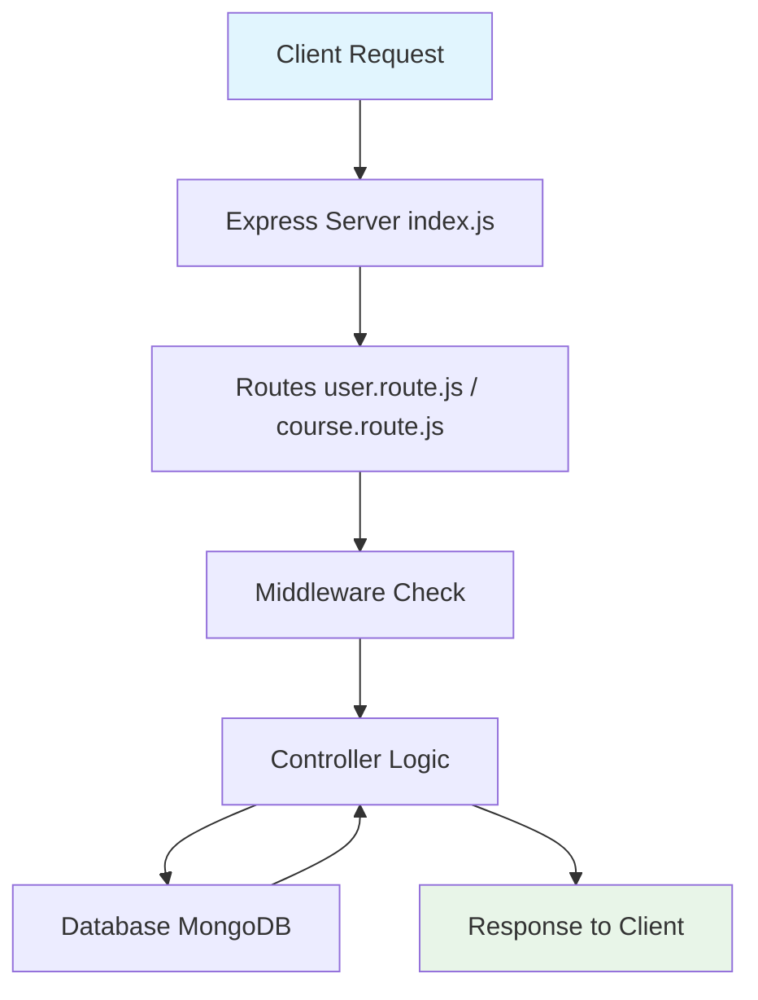
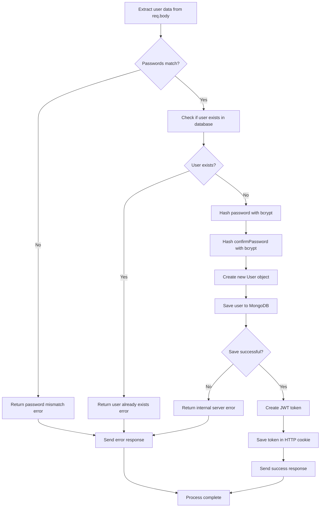
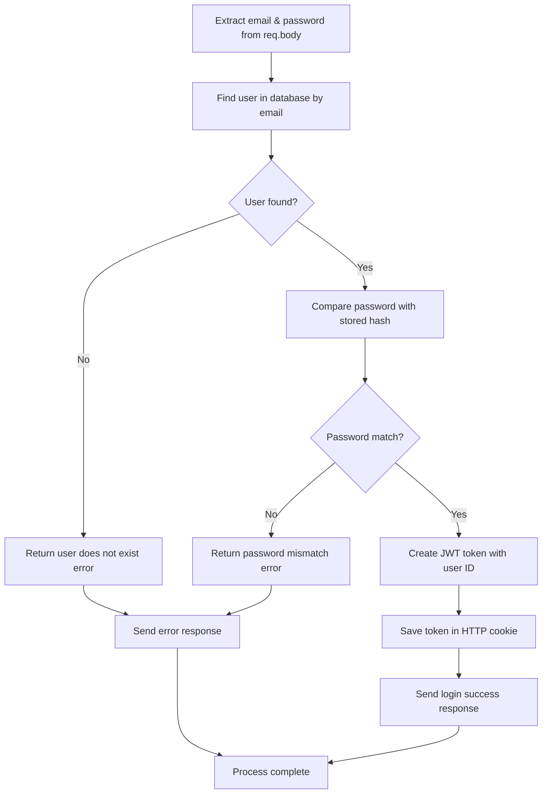
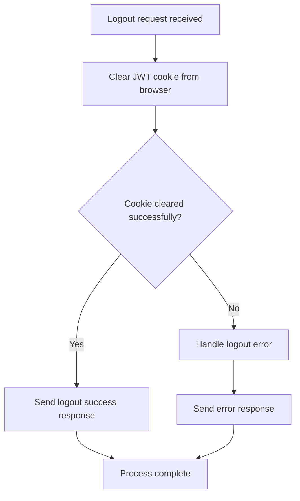
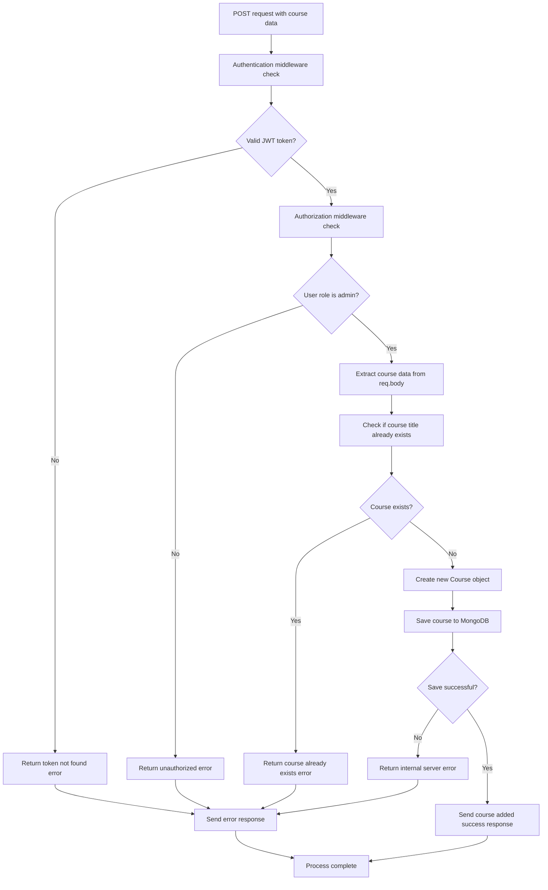
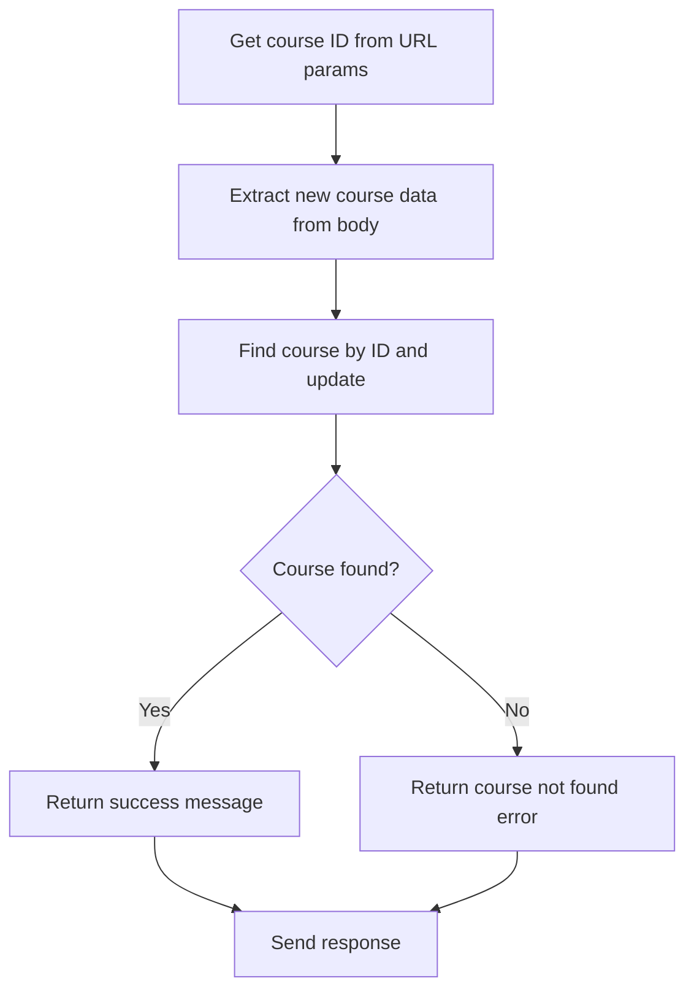
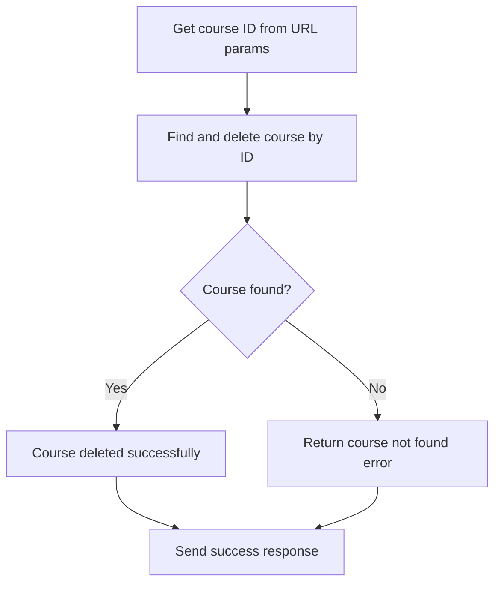
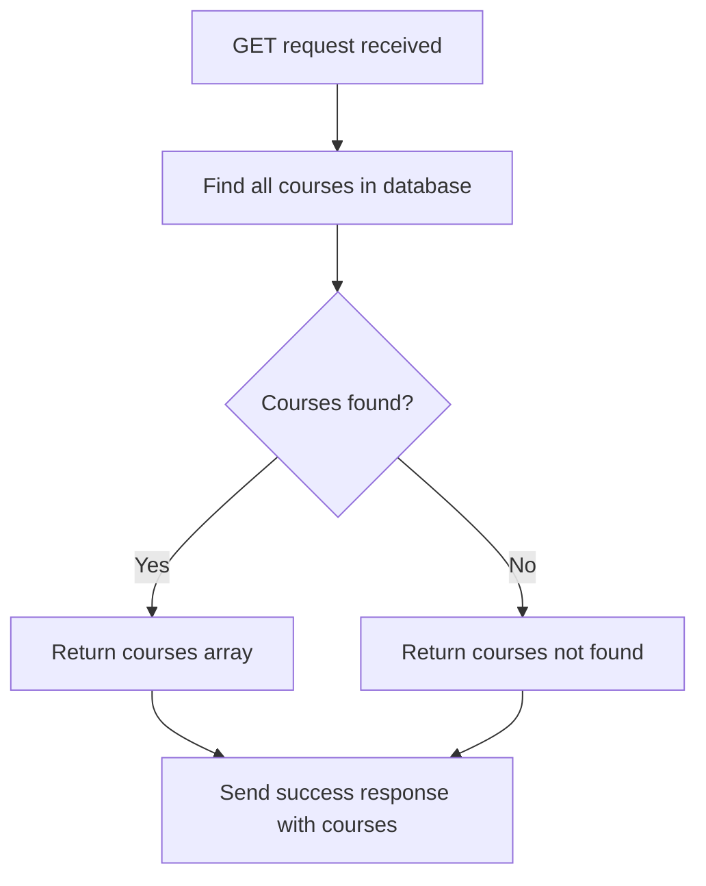
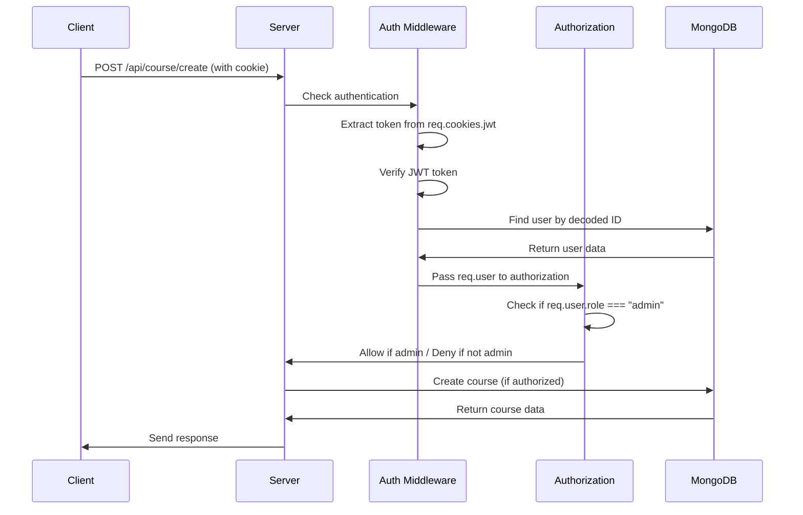

# Backend Project - Simple Guide 📚

## 📦 NPM Packages Used

```json
{
  "bcrypt": "^6.0.0",           // Password hashing
  "cookie-parser": "^1.4.7",   // Parse cookies from request
  "dotenv": "^17.2.0",         // Environment variables
  "express": "^5.1.0",         // Web framework
  "jsonwebtoken": "^9.0.2",    // JWT tokens
  "mongoose": "^8.16.4",       // MongoDB connection
  "nodemon": "^3.1.10"         // Auto-restart server
}
```

## 🏗️ Project Structure

```
backend/
├── index.js              // Main server file
├── models/               // Database schemas
│   ├── user.model.js     // User data structure
│   └── course.model.js   // Course data structure
├── controller/           // Business logic
│   ├── user.controller.js
│   └── course.controller.js
├── routes/              // API endpoints
│   ├── user.route.js
│   └── course.route.js
├── middleware/          // Security layers
│   ├── authentication.middleware.js
│   └── authorization.middleware.js
└── jwt/                 // Token creation
    └── token.js
```

## 🔄 Complete System Flow



## 🚀 Server Setup (index.js)

### Step 1: Import Dependencies
```javascript
import express from 'express';
import mongoose from 'mongoose';
import cookieParser from "cookie-parser";
```

### Step 2: Connect Database
```javascript
mongoose.connect(MONGODB_URI);
```

### Step 3: Setup Middleware
```javascript
app.use(express.json());      // Parse JSON data
app.use(cookieParser());      // Parse cookies
```

### Step 4: Setup Routes
```javascript
app.use("/api/user", userRoutes);     // User endpoints
app.use("/api/course", courseRoutes); // Course endpoints
```

## 👤 User System

### User Model (user.model.js)
```javascript
{
  name: String,           // User full name
  email: String,          // Unique email
  password: String,       // Hashed password
  confirmPassword: String, // Hashed confirm password
  role: String            // "admin" or "user"
}
```

### User Routes (user.route.js)
```
POST /api/user/signup   → signUp controller
POST /api/user/login    → login controller
POST /api/user/logout   → logout controller
```

### User Controller Functions

#### 1. Sign Up Process


**Step by step:**
1. Extract: `const { name, email, password, confirmPassword, role } = req.body`
2. Validate: `if (password != confirmPassword)` → return error
3. Check: `const user = await User.findOne({ email })`
4. Validate: `if (user)` → return "user already exists"
5. Hash: `const hashedPassword = await bcrypt.hash(password, 10)`
6. Hash: `const hashedConfirmPassword = await bcrypt.hash(confirmPassword, 10)`
7. Create: `const newUser = new User({ name, email, password: hashedPassword, confirmPassword: hashedConfirmPassword, role })`
8. Save: `await newUser.save()`
9. Token: `createTokenAndSaveCookie(newUser._id, res)`
10. Response: Success message or error handling

#### 2. Login Process


**Step by step:**
1. Extract: `const { email, password } = req.body`
2. Find: `const user = await User.findOne({ email })`
3. Validate: `if (!user)` → return "user does not exists"
4. Compare: `const isMatch = await bcrypt.compare(password, user.password)`
5. Validate: `if (!isMatch)` → return "password does not match"
6. Token: `createTokenAndSaveCookie(user._id, res)`
7. Response: "user login successfully" or error handling

#### 3. Logout Process


**Step by step:**
1. Request: User sends logout request
2. Clear: `res.clearCookie("jwt")` - removes JWT token from browser
3. Try: Attempt to send success response
4. Response: `res.status(200).json({message: "user logout successfully"})`
5. Catch: Handle any errors with `res.status(500).json({message: "user logout successful"})`

## 📚 Course System

### Course Model (course.model.js)
```javascript
{
  title: String,       // Course title
  description: String, // Course details
  price: Number,       // Course price
  image: String        // Course image URL
}
```

### Course Routes (course.route.js)
```
POST   /api/course/create    → courseCreate (Protected)
PUT    /api/course/update/:id → courseUpdate
DELETE /api/course/delete/:id → courseDelete
GET    /api/course/get       → courseGet
```

### Course Controller Functions

#### 1. Create Course (Admin Only)


**Step by step:**
1. Middleware: `authentication` - verify JWT token from cookies
2. Middleware: `authorization` - check if `req.user.role === "admin"`
3. Extract: `const { title, description, price, image } = req.body`
4. Check: `const course = await Course.findOne({ title })`
5. Validate: `if (course)` → return "course already exists"
6. Create: `const newCourse = new Course({ title, description, price, image })`
7. Save: `await newCourse.save()`
8. Response: "newCourse added successfully" or error handling

#### 2. Update Course


**Step by step:**
1. Extract: `const { id } = req.params` (from URL)
2. Extract: `{ title, description, price, image }` from req.body
3. Update: `Course.findByIdAndUpdate(id, { title, description, price, image }, { new: true })`
4. Check: If course exists
5. Response: Success or "course not found"

#### 3. Delete Course


**Step by step:**
1. Extract: `const { id } = req.params` (from URL)
2. Delete: `Course.findByIdAndDelete(id)`
3. Check: If course exists
4. Response: Success or "course not found"

#### 4. Get All Courses


**Step by step:**
1. Find: `Course.find()` (get all courses)
2. Check: If courses exist
3. Response: Success with courses array or "courses not found"

## 🔒 Authentication System

### JWT Token Creation (token.js)

**Step by step:**
1. Create: `jwt.sign({ userId }, JWT_SECRET_KEY, { expiresIn: "10d" })`
2. Save: `res.cookie("jwt", token, { httpOnly: true, secure: true })`

### Authentication Middleware

```mermaid
graph TD
    A[Request comes to protected route] --> B[Extract JWT token from req.cookies.jwt]
    B --> C{Token exists?}
    C -->|No| D[Return Token not found error]
    C -->|Yes| E[Verify token with JWT_SECRET_KEY]
    E --> F{Token valid?}
    F -->|No| G[Return Invalid token error]
    F -->|Yes| H[Decode token to get userId]
    H --> I[Find user in database by decoded userId]
    I --> J{User found?}
    J -->|No| K[Return user not found error]
    J -->|Yes| L[Attach user object to req.user]
    L --> M[Call next middleware with next()]
    D --> N[Send error response - Stop process]
    G --> N
    K --> N
    M --> O[Continue to next middleware/controller]
```

**Step by step:**
1. Extract: `const token = req.cookies.jwt` - get JWT from HTTP cookies
2. Validate: `if (!token)` → return "Token not found"
3. Verify: `const decoded = jwt.verify(token, process.env.JWT_SECRET_KEY)` - decode JWT
4. Find: `const user = await User.findById(decoded.userId)` - get user from database
5. Validate: `if (!user)` → return "user not found"
6. Attach: `req.user = user` - make user available to next functions
7. Continue: `next()` - proceed to authorization or controller
8. Error: Handle any JWT verification errors with 500 status

### Authorization Middleware

```mermaid
graph TD
    A[Request comes from authentication middleware] --> B[req.user already attached by auth middleware]
    B --> C[Check req.user.role value]
    C --> D{Is role equal to admin?}
    D -->|Yes| E[User is admin - Allow access]
    D -->|No| F[User is not admin - Deny access]
    E --> G[Call next() - Continue to controller]
    F --> H[Return 400 unauthorized error]
    G --> I[Proceed to protected controller function]
    H --> J[Stop process - Send error response]
```

**Step by step:**
1. Receive: `req.user` object from authentication middleware (already verified)
2. Check: `if(req.user.role != "admin")` - compare user role with "admin"
3. Deny: `return res.status(400).json({message: "unauthorized"})` - if not admin
4. Allow: `next()` - if user is admin, continue to controller
5. Result: Only admin users can access protected routes (like create course)

## 🔄 Complete Authentication Flow Example

### Example: Create Course (Protected Route)



## 🎯 API Testing Examples

### 1. Sign Up
```bash
POST /api/user/signup
{
  "name": "John Doe",
  "email": "john@example.com",
  "password": "123456",
  "confirmPassword": "123456",
  "role": "user"
}
```

### 2. Login
```bash
POST /api/user/login
{
  "email": "john@example.com",
  "password": "123456"
}
```

### 3. Create Course (Admin Only)
```bash
POST /api/course/create
Cookie: jwt=your_jwt_token
{
  "title": "React Course",
  "description": "Learn React",
  "price": 999,
  "image": "image_url"
}
```

## 🔧 Environment Variables

Create `.env` file:
```
PORT=4000
MONGODB_URI=mongodb://localhost:27017/your_database
JWT_SECRET_KEY=your_secret_key
```

## 🚀 How to Run

1. Install dependencies:
   ```bash
   npm install
   ```

2. Start server:
   ```bash
   npm start
   ```

3. Server runs on: `http://localhost:4000`

## 📝 Key Concepts Summary

1. **Models**: Define data structure for MongoDB
2. **Controllers**: Handle business logic
3. **Routes**: Define API endpoints
4. **Middleware**: Add security layers
5. **JWT**: Secure user sessions
6. **bcrypt**: Hash passwords safely
7. **Cookies**: Store JWT tokens
8. **Authentication**: Verify user identity
9. **Authorization**: Check user permissions 